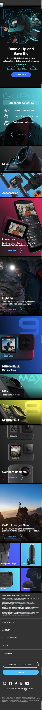
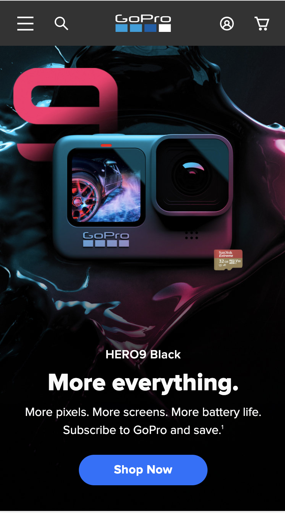
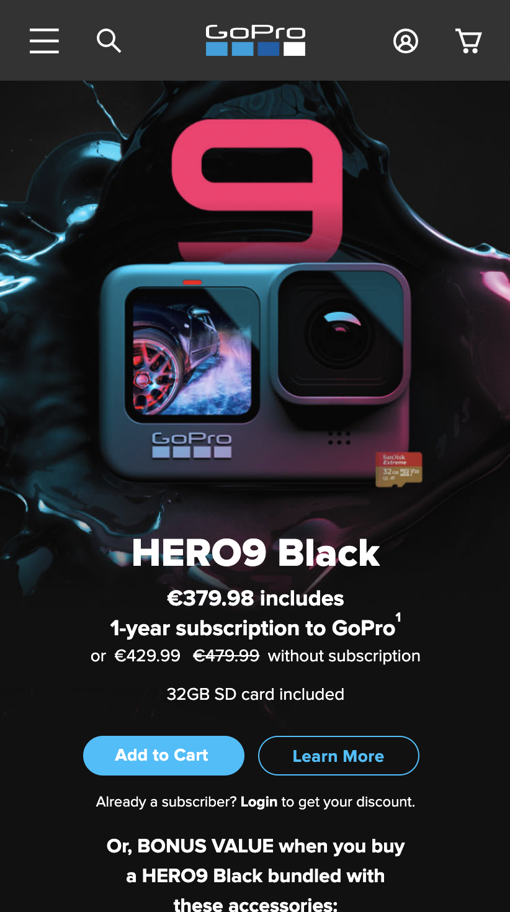

# Procesverslag
**Auteur:** -jouw naam-

Markdown cheat cheet: [Hulp bij het schrijven van Markdown](https://github.com/adam-p/markdown-here/wiki/Markdown-Cheatsheet). Nb. de standaardstructuur en de spartaanse opmaak zijn helemaal prima. Het gaat om de inhoud van je procesverslag. Besteedt de tijd voor pracht en praal aan je website.

## Bronnenlijst
1. <a href="https://www.notion.so/Productbiografie-Frontend-Development-9f9509a9917848f89d446d59aca006ab">Productbiografie Notion</a>
2. -bron 2-
3. -...-

## Eindgesprek (week 7/8)

-dit ging goed & dit was lastig-

**Screenshot(s):**

-screenshot(s) van je eindresultaat-

## Voortgang 3 (week 6)

-same as voortgang 1-

## Voortgang 2 (week 5)

-same as voortgang 1-

## Voortgang 1 (week 3)

### Stand van zaken

Des te langer ik bezig was aan mijn website des te meer ik begreep wat ik moest doen. Ook werd ik er g gemotiveerd als iets gelukt was en het er wel mooi uit zag. 
Wat ik wel nog lastig vind ik het gebruiken van “position” en “flexbox” samen. Ik begrijp hoe ik een pagina kan opmaken met “flexbox” alleen als ik dan ook nog dingetjes ga proberen met “position” veranderd alles weer. Hierdoor ontstond af en toe verwarring. 

**Screenshot(s):**

Op deze afbeelding zie je de GoPro website tot in hoevere in hem nu gemaakt hebt. Hij is nog niet af! Ik ga de header nog aanpassen en wil ook mijn code iets netter schrijven als dat ik nu gedaan heb. 

### Agenda voor meeting

-samen met je groepje opstellen-

| student 1      | student 2          | student 3    | student 4        |
| ---            | ---                | ---          | ---              |
| dit bespreken  | en dit             | en ik dit    | en dan ik dat    |
| an dat ook nog | dit als er tijd is | nog een punt | dit wil ik zeker |
| ...            | ...                | ...          | ...              |

### Verslag van meeting

-na afloop snel uitkomsten vastleggen-

## Breakdownschets (week 1)

## Intake (week 1)
-uitwerken voor de kick-off werkgroep - begin van de eerste week-

**Je startniveau:** Blauw

**Je focus:** Responsive

**Je opdracht:** Gopro: https://gopro.com/en/nl/ 

**Screenshot(s) van de eerste pagina (small screen):**

**Screenshot(s) van de tweede pagina (small screen):**

